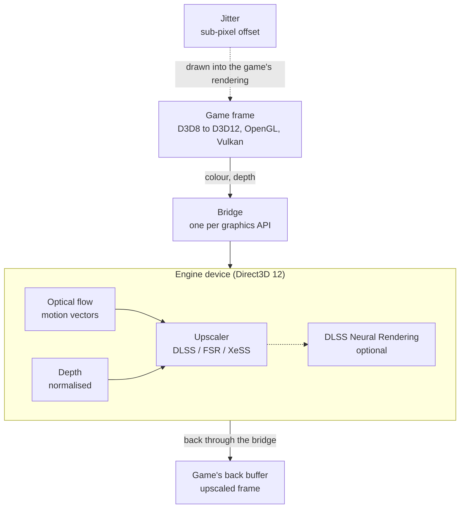

# Aeon SR

A ReShade add-on that brings temporal upscaling and anti-aliasing through NVIDIA
DLSS, AMD FSR and Intel XeSS to games that never shipped with them. It runs on
every graphics API ReShade supports, and motion vectors come from a built-in
optical flow estimator, so the game does not need to provide them.

Author: **Barbatos AWLS**

## Features

- **Temporal upscaling and anti-aliasing** through NVIDIA DLSS, AMD FSR (FSR 4
  where the GPU supports it, FSR 3.1 otherwise) and Intel XeSS
- **Built-in optical flow** that produces the motion vectors the upscalers need
- **No native motion vectors required** from the game
- **Sub-pixel jitter** drawn into the game's own rendering
- **Every graphics API**: DirectX 8, 9, 10, 11 and 12, OpenGL and Vulkan
- **32-bit and 64-bit games**
- **DLSS Neural Rendering** as an optional pass, with a runtime you supply
- **RTX Video Super Resolution** as an experiment: a spatial upscaler for
  DirectX 11 games that rarely improves on the temporal ones

## Download

Ready-to-install packages are on the [Releases](../../releases) page. Each one
holds the add-on, `AeonSRHost.exe`, `ngxshim\`, `runtime\` with the vendor DLLs
listed below, and `Licenses\` with every vendor's licence.

## Installing

1. Install ReShade **with add-on support** for the game.
2. Copy the add-on (`AeonSR.addon64`, or `AeonSR.addon32` for a 32-bit game),
   `AeonSRHost.exe`, `ngxshim\` and `runtime\` next to the game's executable.
3. Open the ReShade overlay and configure Aeon SR in its Add-ons tab.

Do not use Aeon SR in games protected by anti-cheat.

## Upscaler runtimes

Aeon SR drives the vendors' own runtime DLLs. They are not part of Aeon SR and
keep their own licences (see [THIRD-PARTY-NOTICES.md](THIRD-PARTY-NOTICES.md)).
None of them is committed to this repository: each vendor SDK is a git submodule
pinned to an official release, and the build copies the DLLs from there.

| Runtime | File | Source | In the release package |
| --- | --- | --- | --- |
| NVIDIA DLSS Super Resolution | `nvngx_dlss.dll` | [NVIDIA DLSS SDK](https://github.com/NVIDIA/DLSS) v310.9.1 | yes |
| AMD FSR | `amd_fidelityfx_upscaler_dx12.dll`, `amd_fidelityfx_loader_dx12.dll` | [AMD FidelityFX SDK](https://github.com/GPUOpen-LibrariesAndSDKs/FidelityFX-SDK) v2.3.0, AMD-signed | yes |
| Intel XeSS | `libxess.dll`, `libxess_dx11.dll` | [Intel XeSS SDK](https://github.com/intel/xess) v3.0.2 | yes |
| NVIDIA DLSS Neural Rendering | `nvngx_dlssnr.dll` | none official | **no**, see below |

### DLSS Neural Rendering

`nvngx_dlssnr.dll` is not in the DLSS SDK and there is no official channel to
redistribute it, so neither the repository nor the releases carry it. Everything
else works without it; the neural rendering pass stays off until the file is
present. To enable it, place a copy you obtained yourself in `runtime/` next to
the add-on (or in `runtime/dlss5-allgpu/`, which is searched first).

## Community runtimes (at your own risk)

Aeon SR is built and tested with the official runtimes above. Some users choose
community builds of these runtimes, for example to run FSR 4 on GPUs AMD's own
build does not cover. Aeon SR does not distribute them, and a release never
contains one. If you choose to use one, it comes from your own source and is your
own risk: such builds are not made, signed or supported by NVIDIA or AMD, are not
supported by this project, and may be flagged by antivirus or anti-cheat software.

A file placed in one of these folders is used in place of the official runtime,
which stays untouched as the fallback:

| Runtime | Folder |
| --- | --- |
| FSR 4 community build | `runtime/fsr4-int8/amd_fidelityfx_upscaler_dx12.dll` |
| DLSS Neural Rendering for RTX 20/30/40 | `runtime/dlss5-allgpu/nvngx_dlssnr.dll` |

Removing the file from that folder returns to the official runtime.

## Architecture



- **One engine, one bridge per API.** FSR 4 and DLSS Neural Rendering exist only
  for Direct3D 12, so all the work runs on a single Direct3D 12 engine device on
  the game's GPU. In a Direct3D 12 game the engine is the game's own device and
  nothing is copied. On every other API a bridge shares the game's colour and
  depth with the engine (shared textures on Direct3D 9 to 11, external memory on
  OpenGL and Vulkan) and returns the upscaled frame. A DirectX 8 game reaches
  ReShade as DirectX 9 through d3d8to9.
- **Motion vectors.** The optical flow estimator runs on the engine device and
  produces dense motion vectors from the colour buffer, with a camera model fitted
  through depth for thin geometry such as wires and fences.
- **Jitter.** The sub-pixel offset the upscalers need is drawn into the game's own
  rendering (its shaders, its projection or its viewport, depending on the API).
  The add-on then tries to put the interface back as the game drew it. How well
  that works depends on the game: in some, Earth Defense Force 6 among them, the
  interface can still shake with the jitter.
- **32-bit games.** The vendor runtimes are 64-bit only. `AeonSR.addon32` hands
  the frame to `AeonSRHost.exe`, a 64-bit process that holds the engine and runs
  the upscalers.
- **RTX Video Super Resolution** is an experiment. It runs through NVAPI on the
  game's own Direct3D 11 device, needs no motion vectors and, being spatial,
  rarely improves on the temporal upscalers.
- **`ngxshim\nvngx.dll`** is a small forwarder through which the add-on loads the
  DLSS Neural Rendering runtime. It sits in its own folder so it is never mistaken
  for NVIDIA's NGX core.
- **`AeonSRPrebuild.exe`** builds FSR 4's shader pipelines in a separate process,
  so a new configuration's driver compile does not stall the game.

The code for each part is under its module in `src/`, listed in
[Source layout](#source-layout).

## Building

Requirements: Windows, Visual Studio 2022 (or Build Tools) with the C++ workload,
CMake 3.20+ and Git.

```powershell
git clone https://github.com/BarbatosAWLS/AeonSR.git
cd AeonSR
git submodule update --init --depth 1
git -C external/reshade submodule update --init --depth 1 deps/imgui deps/minhook deps/spirv
cmake -S . -B build\x64 -G "Visual Studio 17 2022" -A x64
cmake --build build\x64 --config Release
cmake -S . -B build\x86 -G "Visual Studio 17 2022" -A Win32
cmake --build build\x86 --config Release
```

The submodules under `external/` are ReShade (headers, ImGui, MinHook, the effect
compiler), the NVIDIA DLSS SDK, the Intel XeSS SDK, the AMD FidelityFX SDK and the
Vulkan headers. The FidelityFX API and DX11 headers, the OpenGL headers and the
XeSS declarations the add-on compiles against are in `third_party/`.

The x64 build produces, in `build\x64\Release\`, `AeonSR.addon64`,
`AeonSRHost.exe` (the 64-bit process that runs the vendor upscalers for 32-bit
games), `ngxshim\nvngx.dll` and `runtime\` with the vendor DLLs. The Win32 build
produces `AeonSR.addon32`; a 32-bit game also needs `AeonSRHost.exe` and
`runtime\` from the x64 build next to it.

`cmake --install build\x64 --config Release --prefix package` followed by the
same for `build\x86` assembles the release layout, `Licenses\` included. The
`Build and release` workflow does exactly that on every `v*` tag and attaches the
zip to a GitHub release.

## Source layout

The add-on lives in `src/<module>/`, its headers in `include/aeon_sr/<module>/`:

| Module | What it holds |
| --- | --- |
| `core` | Entry point, `App`, settings, the panel, diagnostics, the frame plan |
| `upscalers` | The DLSS, FSR, XeSS and RTX VSR backends, their loaders, upscaler capture |
| `ngx` | NGX runtime and sessions, the neural pass, the NGX shim |
| `interop` | The bridge for each graphics API, the engine device, the link to `AeonSRHost.exe` |
| `motion` | The optical flow estimator and its shaders |
| `depth` | Depth normalisation, depth for Direct3D 9 and Vulkan |
| `jitter` | Sub-pixel jitter drawn into the game, its hooks, the interface restore |

`host/` is `AeonSRHost.exe` and `prebuild/` is `AeonSRPrebuild.exe`.

## Licence

Aeon SR is released under the [MIT licence](LICENSE). Third-party components
are listed in [THIRD-PARTY-NOTICES.md](THIRD-PARTY-NOTICES.md).
